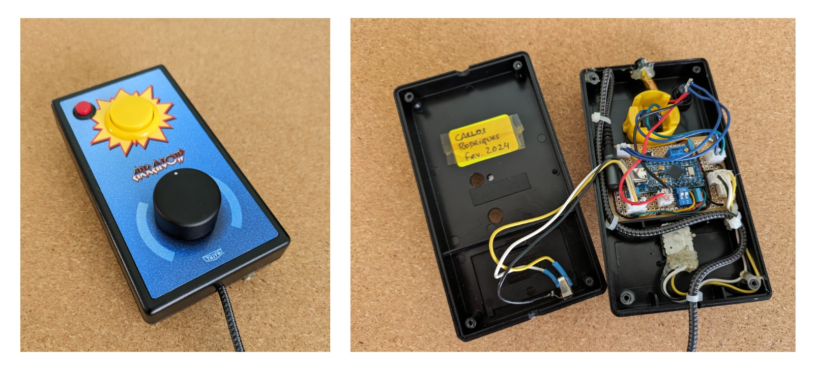
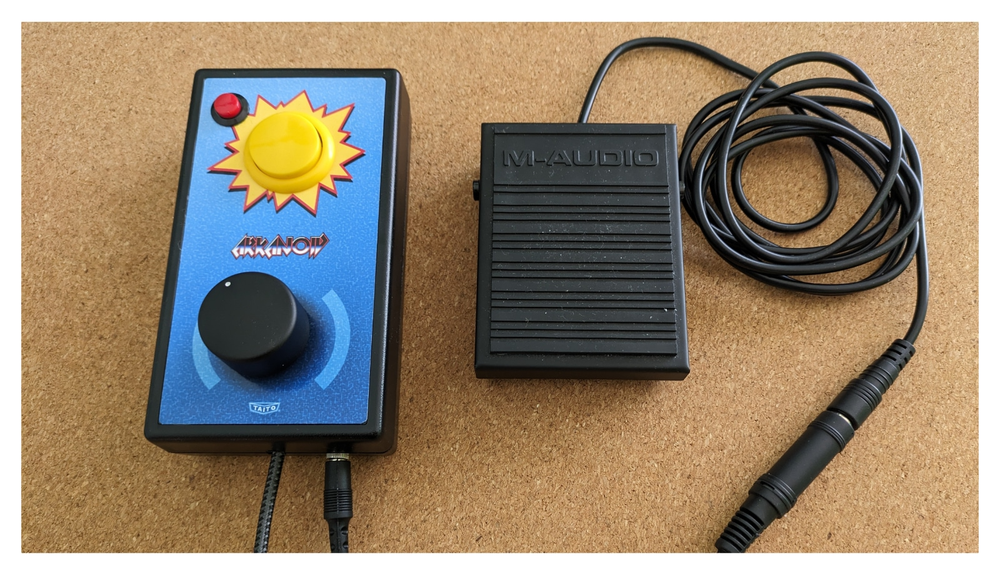
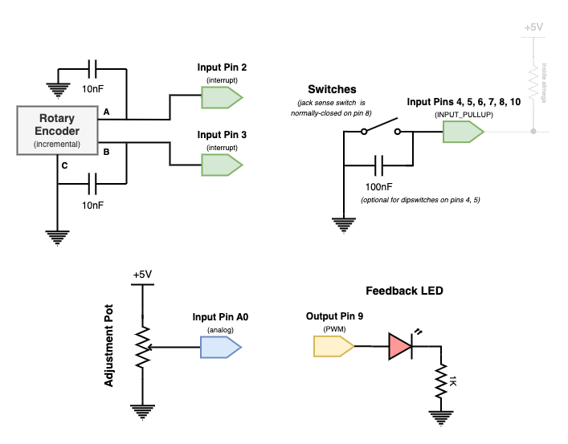
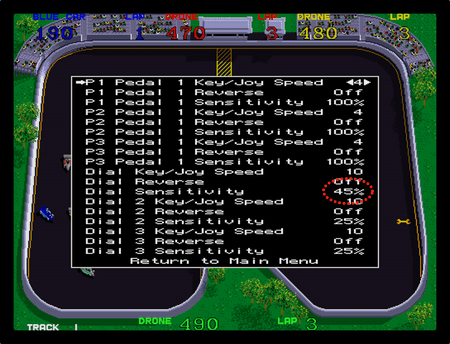
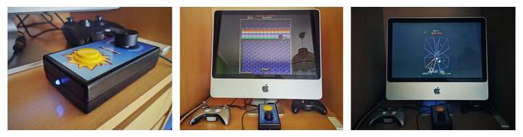

# Spinner Mouse Game Controller

If you ever tried to play the arcade version of [Arkanoid](https://en.wikipedia.org/wiki/Arkanoid) on an emulator, you may have found the game impossibly hard. And by that I mean _impossible_. That's because the game was designed to be played with a rotary controller (called a "spinner" or "dial"), not a joystick. With a spinner, you're directly moving the paddle &ndash; spaceship &ndash; not pushing it.

In most arcade emulators &ndash; [lr-fbneo](https://github.com/libretro/fbneo) and [lr-mame2003-plus](https://github.com/libretro/mame2003-plus-libretro) are my current choices &ndash; you can use a mouse instead. As the MS-DOS version of Arkanoid could also be played with a mouse, that makes it a perfectly cromulent thing to do. But a mouse forces you to play sitting at a desk, which I'd rather avoid.

The [NES](https://en.wikipedia.org/wiki/Nintendo_Entertainment_System) version of Arkanoid shipped with [its own spinner controller](https://www.nesdev.org/wiki/Arkanoid_controller) commonly called the "Vaus" controller, and its simple (and cheap) design inspired me to build my own version that presents itself as an USB mouse &ndash; something that any Arduino-like board based on the [ATmega32U4](https://www.microchip.com/en-us/product/atmega32u4) microcontroller [can easily do](https://www.arduino.cc/reference/en/language/functions/usb/mouse/).

And if I could use it to play some other [spinner-based games](https://wiki.arcadecontrols.com/index.php/Spinner_Turn_Count), the better. So I added an extra button, and the option to connect a pedal that I had lying around from my MIDI keyboard (for up to three buttons total).

## Hardware Features

### External

The main input is a smooth **incremental rotary encoder** commonly used for volume control in audio amplifiers. It costs a fraction of the kind of encoders arcade cabinet enthusiasts would use, which made me fear it might not have enough resolution, but it turned out just fine. This [specific encoder](https://eu.mouser.com/datasheet/2/54/pec16-245034.pdf) has two pulse pins with 24 steps per turn for a final resolution of 96 steps with [quadrature encoding](https://en.wikipedia.org/wiki/Incremental_encoder).

The **primary button** (yellow) is an arcade-style microswitch and the **secondary button** (red) is a generic doorbell push-button. Both are wired to connect to ground when pressed (active-low), in order to use the ATmega's internal pull-up resistors and minimize the number of external components, and are debounced in hardware using 100nF capacitors across their pins, to minimize code complexity.

The (optional) **pedal** is of the type commonly used as a sustain pedal with music keyboards. Internally, it's just a spring-loaded push-button configured in either a normally-open or normally-closed way. It connects using an **audio jack** which includes a normally-closed sense switch that opens on insertion. As before, both of these switches use the ATmega's internal pull-up resistors and get debounced using 100nF capacitors.

An external (blue) **LED** provides some minimal feedback about the controller's operation. As blue LEDs are usually pretty powerful, and harsh, sources of light, it is dimmed to a reasonable level using PWM.

### Internal

Having the mouse move one pixel for each encoder pulse is generally too slow, so there's a **multi-turn potentiometer** to adjust the speed without having to reflash the firmware. There's also a **2-way DIP-switch** block to disable mouse events while testing, and switch between X-axis and Y-axis motion. Both of these adjustments can be done through holes drilled in the back of the case. I didn't bother adding debouncing capacitors for these switches.

## Modes of Operation

### Mouse Button Mapping

By default, the primary button maps to the **left mouse button**, while the secondary button maps to the **right mouse button**. When a pedal is connected, mappings are shifted so the pedal becomes the left mouse button, the primary button becomes the right mouse button, and the secondary button becomes the **middle mouse button**.

The firmware can handle the pedal being connected/disconnected at any time. It also autodetects if the pedal switch is normally-closed or normally-open (the pedal I have can be configured either way).

### Mouse Movement

By default the rotary input moves the mouse pointer as fast as configured using the internal multi-turn potentiometer &ndash; from 1 to 50 steps at a time. If the primary button is kept pressed when connecting the controller, it enters **slow mode** and will always move at 20% of the configured speed. This is useful for emulators such as MAME that have their own sensitivity adjustments.

You may be wondering why slow mode is 20% of the configured speed and not the maximum precision of 96 steps per turn (1 mouse step per encoder pulse): it allows for better use of MAME's dial sensitivity range, which only goes up to 255%.

### Serial Port

Besides providing some debug output when buttons are pressed and so on, it's also possible to switch controller modes by writing to the serial port. Specifically:

  * `s` switches to slow mode;
  * `n` switches to normal mode (whatever's set through the multi-turn potentiometer);
  * `r` switches to the default mode (slow/normal depending on whether the primary button was kept pressed at connect time);
  * `c` shows the current mode.

See the `retropie` directory in this repo for the [runcommand scripts](https://retropie.org.uk/docs/Runcommand/#runcommand-scripts) that I'm using with [RetroPie](https://retropie.org.uk) to dynamically switch modes depending on the emulator being started.

### Sensitivity Settings (in Emulators)

In my case I have the multi-turn potentiometer set for a speed of 22 by default, which I find confortable for Arkanoid running under [lr-fbneo](https://github.com/libretro/fbneo). I prefer to run other games under [lr-mame2003-plus](https://github.com/libretro/mame2003-plus-libretro) to be able to adjust the sensitivity (the controller must be in slow mode for best results, see above).

As different games used spinners with [different resolutions](https://wiki.arcadecontrols.com/index.php/Spinner_Turn_Count), the specific sensitivity settings for each game will also be different. Even games where the original spinner had a much higher resolution seem to work fine (e.g. Arkanoid's spinner had a resolution of 486 steps per turn).

## Parts List

The following two lists include the components that I used for my build, with links to the specific parts I bought. Since I ordered most of them from a nearby portuguese store, most of the linked pages are in portuguese, but should still be useful to figure out what to buy elsewhere if you wish to build your own.

The first list is the minimum needed to support games that only use one button (e.g. [Arkanoid](https://en.wikipedia.org/wiki/Arkanoid), [Super Sprint/Championship Sprint](https://en.wikipedia.org/wiki/Super_Sprint), [Hot Rod](https://en.wikipedia.org/wiki/Hot_Rod_(video_game))) as well as games that use two buttons (e.g. [Tempest](https://en.wikipedia.org/wiki/Tempest_(video_game)), [Badlands](https://en.wikipedia.org/wiki/Badlands_(1989_video_game))). That should cover most cases.

If you'd rather use a pedal on racing games, or play a game that needs the third button (e.g. [APB](https://en.wikipedia.org/wiki/APB_(1987_video_game))), then you'll also need the additional components in the second list.

  * 1x [ATmega32U4 USB-C module](https://www.amazon.es/dp/B0CNR1X3YY) (5V/16MHz)
  * 1x [right-angle USB-C to USB-A cable](https://www.amazon.es/dp/B0BC8Y3BM2)
  * 1x [incremental rotary encoder](https://mauser.pt/catalog/product_info.php?products_id=010-0452) (24 pulse / 360°, smooth rotation) + [knob](https://mauser.pt/catalog/product_info.php?products_id=010-1271) (31x17mm)
  * 1x [arcade push-button](https://mauser.pt/catalog/product_info.php?products_id=010-1065) (32x30mm, microswitch)
  * 1x [small push-button](https://mauser.pt/catalog/product_info.php?products_id=010-0586) (12.7mm, SPST-NO)
  * 1x [miniature push-button](https://mauser.pt/catalog/product_info.php?products_id=010-1162) (6mm, SPST-NO, through-hole)
  * 1x 3.5mm LED
  * 1x 1KΩ resistor (to current-limit the LED)
  * 2x 10nF poliester capacitor (to debounce the rotary encoder pulse pins)
  * 2x 100nF poliester capacitor (to debounce the arcade and small push-buttons)
  * 1x [10KΩ multi-turn potentiometer](https://mauser.pt/catalog/product_info.php?products_id=005-4003)
  * 1x [2-way DIP-switch](https://mauser.pt/catalog/product_info.php?products_id=010-0138)
  * 1x [prototyping circuit board](https://mauser.pt/catalog/product_info.php?products_id=096-3386) (72x47mm, perforated)
  * 1x [project case](https://www.retex.es/en/product/betabox/) (145x80x34mm, ABS plastic)

The miniature push-button is not needed if you choose another ATmega32U4-based module board with a built-in reset switch.

  * 1x [music keyboard sustain pedal](https://m-audio.com/products/view/sp-1) (momentary switch)
  * 1x [male 3.5mm to female 6.3mm jack adapter cable](https://mauser.pt/catalog/product_info.php?products_id=019-0790)
  * 1x [female 3.5mm jack with sense switch](https://mauser.pt/catalog/product_info.php?products_id=011-1072) (mono, panel-mount)
  * 2x 100nF poliester capacitor (to debounce the pedal and jack sense switch)

## Artwork

The artwork was printed with a normal inkjet printer on matte photographic paper. It looks pretty good up close and, so far, seems durable enough. The [source file](artwork/cover.pxd) is in [Pixelmator Pro](https://www.pixelmator.com/pro/) format.

## Final Words

Having an adequate game controller can be crucial for these old games &ndash; it can be the difference between frustration and fun.

At first I built this controller just for Arkanoid, until I figured that I could use another button for the "superzapper" in [Tempest](https://en.wikipedia.org/wiki/Tempest_(video_game)). The pedal was added because driving, accelerating, and using the siren in [APB](https://en.wikipedia.org/wiki/APB_(1987_video_game)) felt awkward. Shifting the accelerator away from my hands was enough to make that game fun for me (abeit still hard).

_-- Carlos Rodrigues, 2024_
